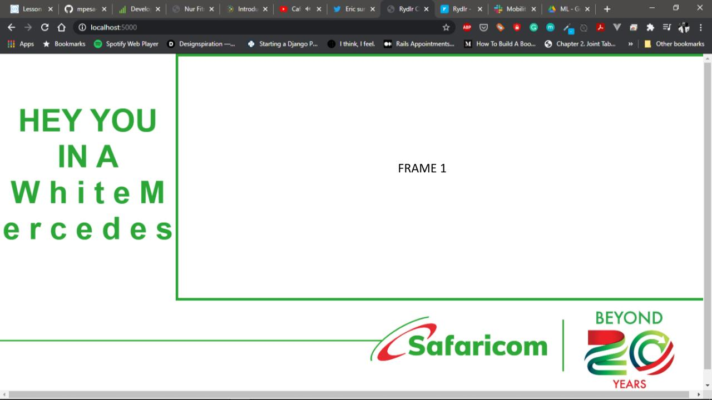
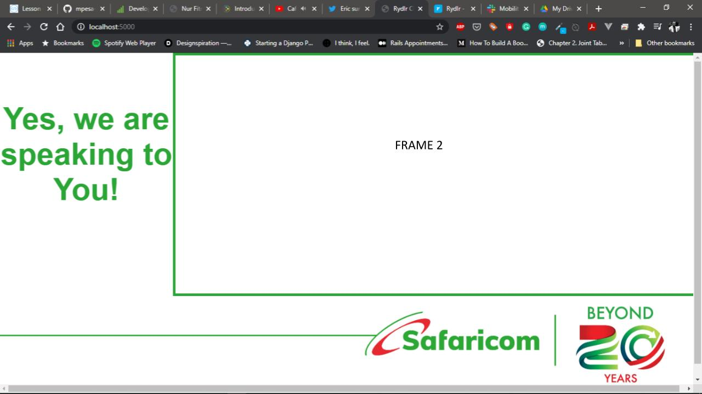
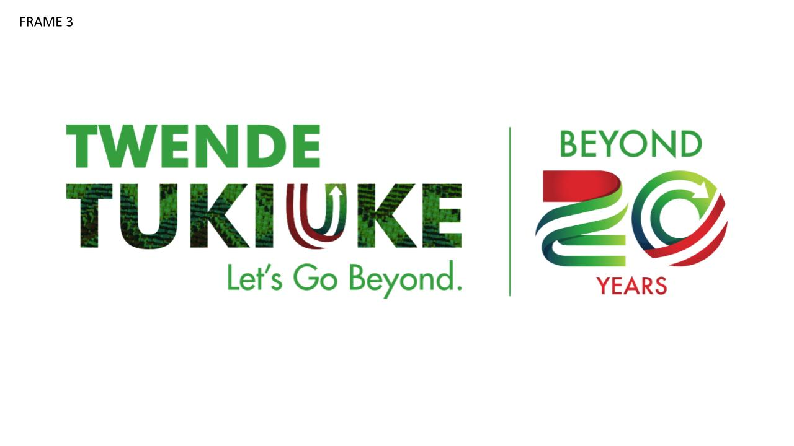
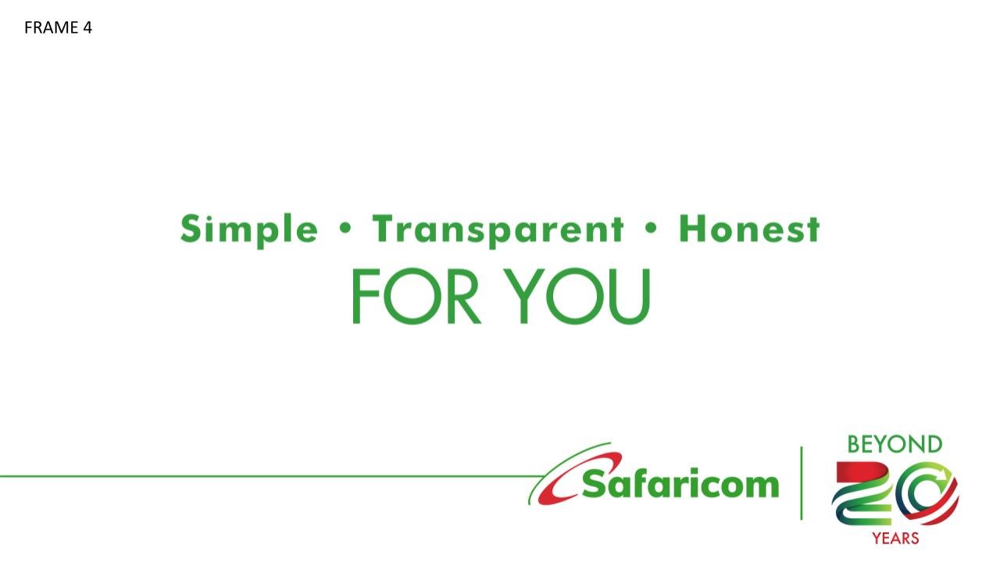

# rydlr1.0
Object detection + PTZ camera metadata
# Rydlr PTZ YOLO Bandit Integration

## Overview
This project integrates YOLOv5 object detection, Hikvision PTZ (Pan-Tilt-Zoom) camera control, contextual bandit-style metadata logging, and a web carousel for real-time monitoring. It is designed to label and stream object detections from a real-world setting like the University Way Roundabout in Nairobi.

## Features
- **Real-Time Object Detection** using YOLOv5
- **PTZ Control** for dynamic object tracking via Hikvision ISAPI
- **Contextual Bandit Metadata Logging** for analytics and decision optimization
- **Web Carousel UI** for viewing recent detections in browser
- **Automatic Frame Capture & Labeling** for dataset generation

## Technologies Used
- Python 3
- OpenCV
- PyTorch
- Flask
- Hikvision ISAPI (PTZ control)
- RTSP streaming
- Threading for simultaneous detection and web server

## Prerequisites
- Python 3.7+
- Hikvision PTZ Camera with RTSP stream access
- Credentials to access camera (username/password)
- NVIDIA GPU recommended for YOLOv5 inference

## Installation
```bash
pip install opencv-python torch torchvision flask requests
```

## Running the Application
1. Update the camera configuration in the script (`CAMERA_IP`, `USERNAME`, `PASSWORD`).
2. Create output directory `./labeled_dataset/University_Way_Roundabout`
3. Run the script:
```bash
python ptz_yolo_bandit_integration.py
```
4. Open browser at `http://localhost:5000` to see the carousel of detections.

## Output
- Cropped images of detected vehicles saved locally.
- JSON log of detections with metadata (label, timestamp, bbox).
- Web interface displays detections in a horizontal carousel at bottom of screen.

## Example Detection Carousel





## Project Video
![Youtube Link][[Demo Video](https://www.youtube.com/watch?v=IwhhjIyKejI)]

## License & Credits
- YOLOv5 by Ultralytics (Apache 2.0 License)
- Markerless motion capture extensions © Rydlr Cloud Services Ltd. 2025
- This project adheres to the MIT "Mens et Manus" principles for applied AI engineering.

---
For advanced deployment or integration with cloud infrastructure (Azure, AWS, GCP, On-Prem), 
contact: **engineering@rydlr.com**


[def]: ./sample_carousel_view_4.jpg